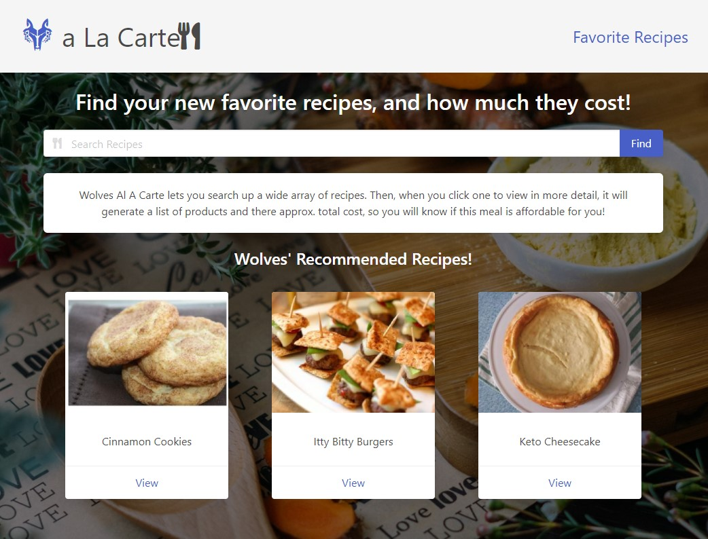
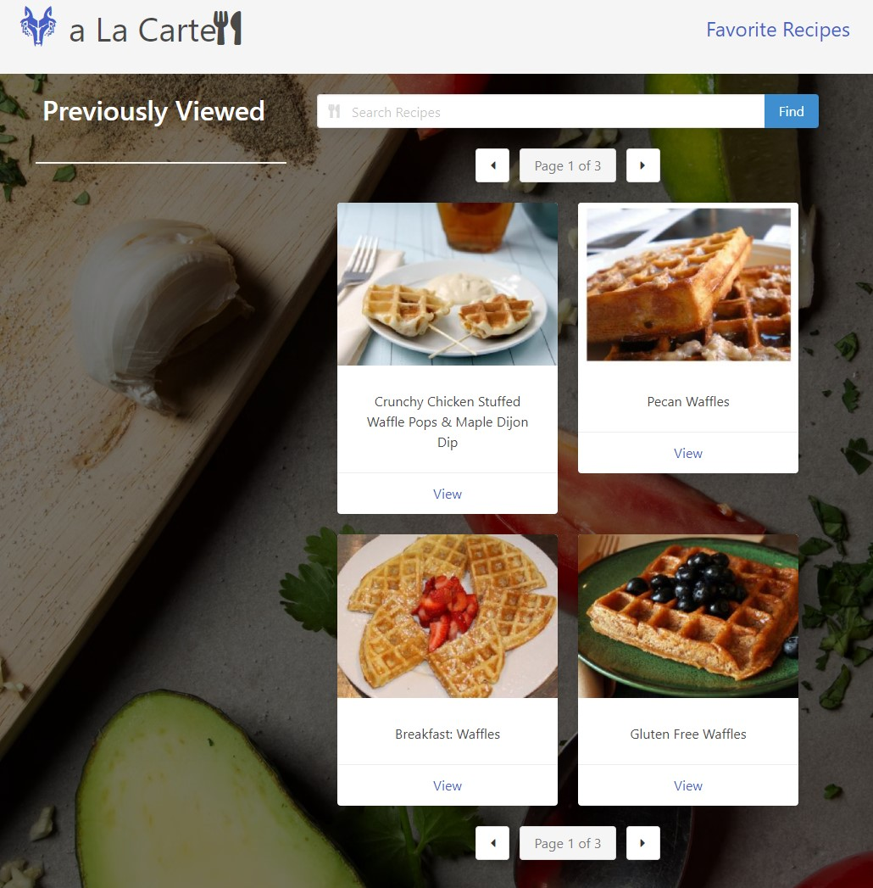
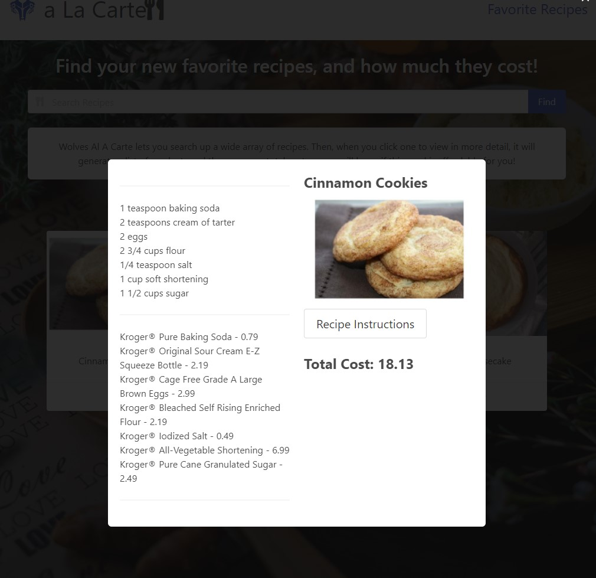
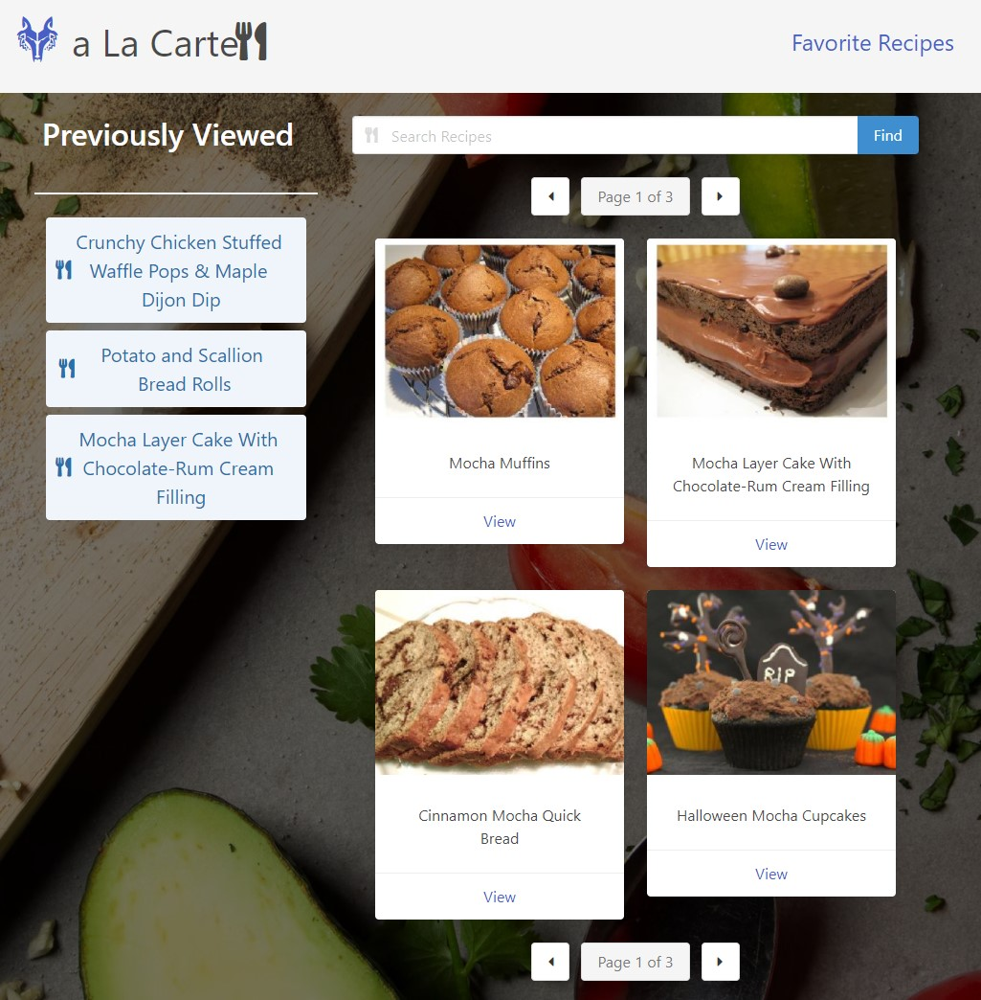
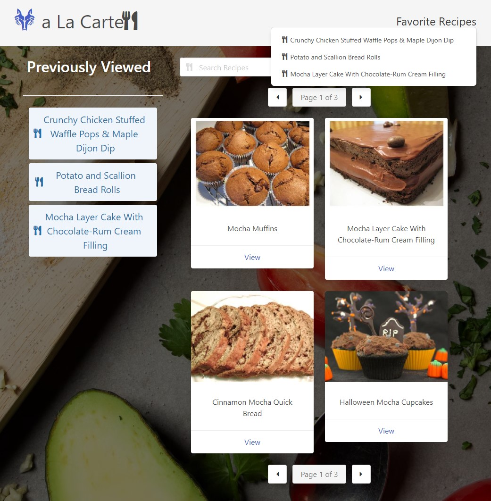

# Wolves a La Carte
Web application to help users find great recipes on the web and learn what an approximate cost of the items needed to make it.

# Features:
-	Search for a recipe
-	Find one that looks great!
-	See the list of ingredients from Spoonacular’s API
-	See an approximate cost of those ingredients using Kroger API
-	Favorite a recipe to save for later

# Page Link
[Click here to see the live deployment.](https://wruback.github.io/Wolves-a-la-carte/)

[Click here to view our Github repository](https://github.com/WRuback/Wolves-a-la-carte)

# Screenshots:

# Frameworks Used:
Built with Bulma – https://bulma.io/

# API Reference:
Spoonacular API – https://spoonacular.com/food-api

Kroger API –  https://developer.kroger.com/sso-redirect/

# Contributors
Billy – wrubackdev@gmail.com - Handled Spoonacular API call, created Search functionality, search results display, favorite functionality, advanced ingredient search algorithm. 

Cole – Created Modals, Styled Modals, Created static recipe information, and the ReadMe

Dre – Created HTML frameworks, styled and crafted branding of the page. 

Ezequiel - Handled Kroger API call, Modal population, Previous recipe functionality. 

## License

>MIT License
>
>Copyright (c) 2022 William Ruback
>
>Permission is hereby granted, free of charge, to any person obtaining a copy
of this software and associated documentation files (the "Software"), to deal
in the Software without restriction, including without limitation the rights
to use, copy, modify, merge, publish, distribute, sublicense, and/or sell
copies of the Software, and to permit persons to whom the Software is
furnished to do so, subject to the following conditions:
>
>The above copyright notice and this permission notice shall be included in all
copies or substantial portions of the Software.
>
>THE SOFTWARE IS PROVIDED "AS IS", WITHOUT WARRANTY OF ANY KIND, EXPRESS OR
IMPLIED, INCLUDING BUT NOT LIMITED TO THE WARRANTIES OF MERCHANTABILITY,
FITNESS FOR A PARTICULAR PURPOSE AND NONINFRINGEMENT. IN NO EVENT SHALL THE
AUTHORS OR COPYRIGHT HOLDERS BE LIABLE FOR ANY CLAIM, DAMAGES OR OTHER
LIABILITY, WHETHER IN AN ACTION OF CONTRACT, TORT OR OTHERWISE, ARISING FROM,
OUT OF OR IN CONNECTION WITH THE SOFTWARE OR THE USE OR OTHER DEALINGS IN THE
SOFTWARE.

